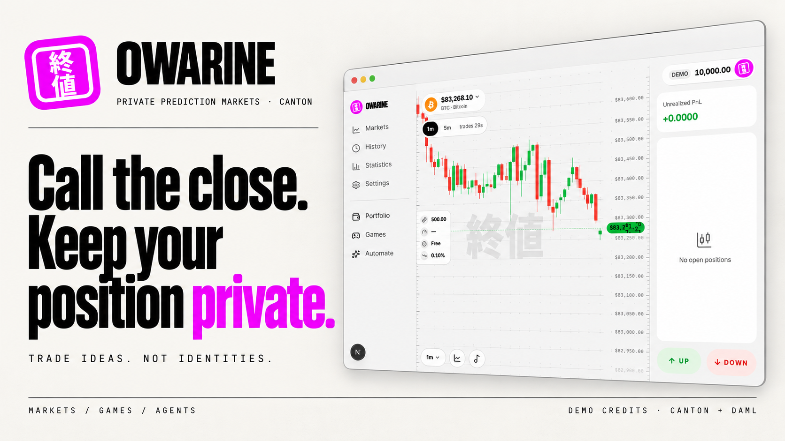
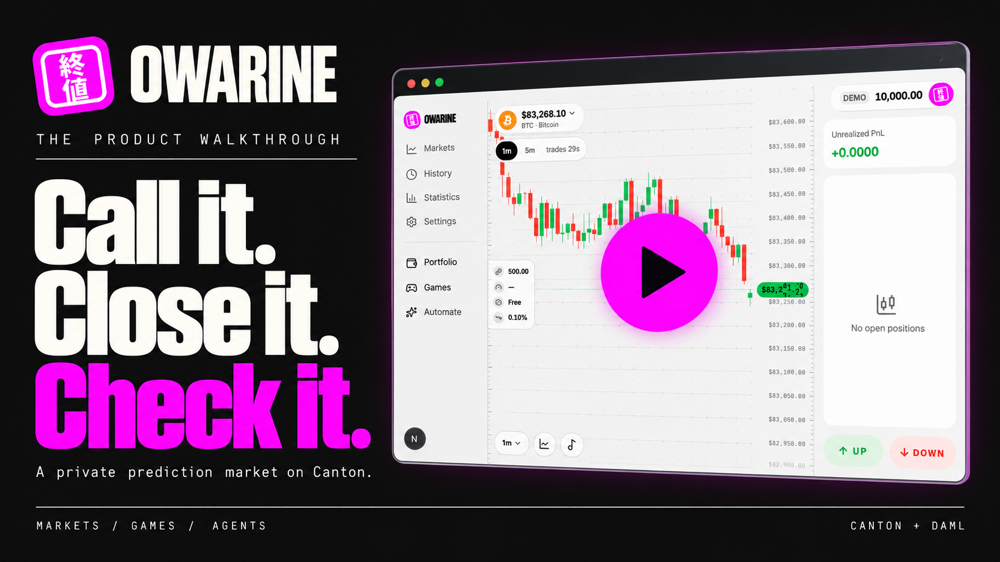
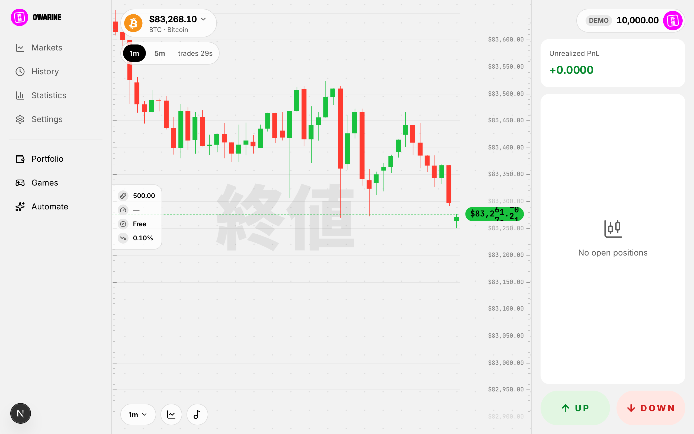
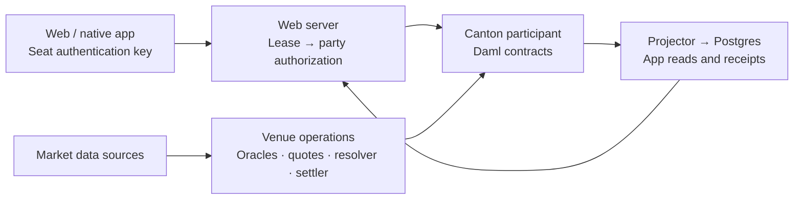

<p align="center">
  <a href="https://owarine.xyz">
    
  </a>
</p>

<h1 align="center">Owarine · 終値</h1>
<p align="center">Call the close. Keep your position private.<br/>Short price predictions, games and trading agents on Canton Network.</p>

<p align="center">
  <a href="https://owarine.xyz"><b>Open Owarine</b></a>
  &nbsp;·&nbsp;
  <a href="https://owarine.xyz/demo"><b>Demo</b></a>
  &nbsp;·&nbsp;
  <a href="https://owarine.xyz/how-it-works"><b>How it works</b></a>
  &nbsp;·&nbsp;
  <a href="https://owarine.xyz/proof"><b>Settlement proof</b></a>
  &nbsp;·&nbsp;
  <a href="https://owarine.xyz/status"><b>Service status</b></a>
  &nbsp;·&nbsp;
  <a href="https://docs.owarine.xyz"><b>Documentation</b></a>
</p>

**Owarine is a private prediction market on Canton, built with Daml.** Pick a short price Window, take Up or Down at the venue's firm quote, watch your position, and close early or let the Window settle. Positions are contracts whose stakeholders are the owner and the venue. Games, copyable strategies and bounded agent desks offer other ways into the same markets, on the web and in the native phone app.

Built for **HackCanton League Season 3 · Financial Applications**. *Owarine* (終値) means **closing price**. This prototype uses **demo credits with no cash value** and **DevNet Canton Coin**. See [what is verified](#what-is-verified) and [prior work](#prior-work-and-hackathon-contribution) before evaluating it.

## The idea

A prediction should not require publishing your entire trading history. Owarine lets someone express a view on the next close while keeping the position between that seat and the venue. Canton supplies contract visibility; Daml supplies the authorization, payout and refund rules.

**One call.** Choose Bitcoin and a five-minute Window. The opening print sets the line. Up wins if the closing print is at or above it; Down wins if it is below. Before accepting, read the quote for your size, the cost, fee and possible payout. A winning lot pays one demo credit; a losing lot pays zero. A void returns the stake and fee. A displayed spot price is not itself a settlement print.

| Way in | What you do | Start here |
| --- | --- | --- |
| **Predict** | Call stocks, crypto, tokenized-stock prices, pre-IPO names or baskets. Read the actual lane hours and source availability. | [Markets](https://owarine.xyz/markets) · [trading guide](docs-site/content/docs/trading/first-trade.mdx) |
| **Play** | Practice, compete in a duel, or try the chart games. Some games practice locally; others create ledger contracts. | [Games](https://owarine.xyz/games) · [game guides](docs-site/content/docs/games) |
| **Put a strategy to work** | Publish, copy or fade a strategy, or create a desk with allowed instruments and spending limits. Desk practice is paper; a funded mandate is a separate path. | [Agents](https://owarine.xyz/agents) · [Desk](https://owarine.xyz/desk) · [desk guide](docs-site/content/docs/agents/desk.mdx) |
| **Inspect the result** | Follow the opening and closing prints, resolution, payout and receipt. | [Proof](https://owarine.xyz/proof) · [Portfolio](https://owarine.xyz/portfolio) |

A prediction on a tokenized-stock price does **not** buy the underlying share. Pooled guest seats are a demo identity, not a durable account for real-money custody.

## Demo video

<p align="center">
  <a href="https://owarine.xyz/demo">
    
  </a>
</p>

**[Open the demo](https://owarine.xyz/demo).** Click the play-button cover above to open the website's demo page. The cover is an editorial composition based on a dated Owarine app screen; the artwork itself is not a recording or a transaction receipt.

For an evidence walkthrough now, read the [recorded DevNet acceptance](.github/verification/acceptance.md): firm quote → acceptance → owner and outsider reads → oracle prints → resolution → settlement. It also includes the void refund, stale refund with operations stopped, and Canton Coin deposit/withdrawal records. Failed attempts are retained alongside the successful runs.

The [documentation walkthroughs](https://docs.owarine.xyz) include eleven captioned recordings of the hosted app, with arrows pointing to the controls used. The [first-trade guide](https://docs.owarine.xyz/trading/first-trade) records a BTC call reaching settlement; each guide separates what the recording demonstrates from unavailable or untested paths.

<details>
<summary>Inspect the original product screen used for the artwork</summary>



This unchanged capture shows the interface at that date. It is separate from the generated banner and cover, and does not prove a newly executed ledger trade.

</details>

## Try one Window

1. Open [Markets](https://owarine.xyz/markets) and choose a lane whose current state permits trading. Crypto runs around the clock when its feeds are available; stock lanes follow their session calendar.
2. Take a **seat** and accept the demo-credit terms. The device makes a key; the server maps its authenticated requests to a leased Canton party. Read the selected network, price source, Window deadline and quote before choosing Up or Down.
3. Watch the position, request a sell-back where available, or wait for settlement. Then inspect [Portfolio](https://owarine.xyz/portfolio) and [Proof](https://owarine.xyz/proof). An unavailable quote or feed is a reason to wait, not a guaranteed executable trade.

[Your seat](docs-site/content/docs/start/wallet.mdx) · [Price sources](docs-site/content/docs/architecture/price-sources.mdx) · [Availability](docs-site/content/docs/help/availability.mdx)

## How a call works

1. **Open the Window.** Venue operations create fixed terms from a Series: the opening time, lock, expiry, oracle policy and refund deadline.
2. **Hold a quote.** The venue quotes the exact side and size, reserves its backing, and gives the quote an expiry. The venue is the counterparty.
3. **Accept.** The seat-authorized request accepts that quote. Daml consumes the quote and creates the owner's position and the venue's opposite position atomically.
4. **Admit prices.** Three oracle parties attest boundary prices. Resolution requires the configured quorum and deviation checks; missing or disagreeing evidence can void the Window.
5. **Resolve once.** The resolver consumes the opening/resolution chain. It cannot both resolve and void the same Window.
6. **Pay or refund.** Operations settle the positions. An owner can claim against the result; after the stale-refund deadline, the contract provides a refund path that does not need the venue's settlement process running.

The source data is **attested by the venue's oracle parties**. Three signers do not make the upstream feeds independent, and Owarine does not claim that every provider's cryptographic update is verified inside Daml. See the [price policies](services/ops/config/price-sources.json), [print rules](packages/core/src/market/print-source.ts) and [Daml engine](daml/abu-pm-main/daml/PM).

## Architecture and privacy



**The privacy boundary matters.** An ordinary position and cash contract name the seat and venue as stakeholders; another party's ledger query does not receive them. The venue sees its counterparties. In this prototype, Noders hosts the parties on one participant and one server ledger user can act for them, so **the participant operator and the application server remain trusted**. The device key authenticates a seat request; it is not evidence of independently hosted, externally signed parties. Public posts and opted-in records reveal what the user chooses to publish; a duel has both players as stakeholders.

[Privacy tests](daml/pm-tests/daml/Test/Privacy.daml) · [seat authorization](web/src/lib/seat-lease.server.ts) · [party-view route](web/src/app/api/view/route.ts) · [architecture guide](docs-site/content/docs/architecture/overview.mdx)

## Built on Canton

| Piece | Role in Owarine | Code |
| --- | --- | --- |
| **Canton Network** | Party-scoped contracts and a shared participant on Noders DevNet. | [Ledger client](packages/ledger) · [DevNet preflight](scripts/devnet-preflight.ts) |
| **Daml `abu-pm-main` 0.5.2** | Windows, prices, quotes, positions, cash, settlement, refunds, reserves and resting calls. | [Main package](daml/abu-pm-main) |
| **`abu-pm-tickets` 0.1.4** | Range, Moonshot, Parlay and Boost contracts. | [Tickets](daml/abu-pm-tickets) |
| **`abu-pm-agents` 0.2.2** | Strategies, subscriptions, creator fees and bounded desk mandates. | [Agents](daml/abu-pm-agents) |
| **`abu-pm-games` 0.1.2** | Duel contracts, results and season prizes. | [Games](daml/abu-pm-games) |
| **`abu-pm-cc` 0.1.1 · CIP-56** | Token-standard Canton Coin deposits, withdrawals and reserve statements. The recorded round trip uses DevNet coin. | [Coin rail](daml/abu-pm-cc) · [rail operations](packages/markets/src/ops/cc) |
| **`abu-pm-seat` 0.1.0** | Standing exits and send/accept demo-credit transfers. | [Seat package](daml/abu-pm-seat) |
| **JSON Ledger API v2** | Submission, active-contract reads, command deduplication and the update stream. | [Client](packages/ledger/src) · [generated bindings](packages/daml-clients) |
| **Next.js · Expo · Postgres** | Web, native app, seat leases, projections and journals. | [Web](web) · [Mobile](mobile) · [Database](packages/db) |

The six package versions are in the checked-in source and release files. Deployment and execution are different claims: a package being registered does not prove every feature using it has completed a DevNet journey. [Released DARs and hashes](daml/released/MANIFEST.md) · [Daml Script tests](daml/pm-tests)

## What is verified

Evidence snapshot: **8 October 2026**. The [complete capability inventory](.github/verification/capabilities.json) preserves 219 entries and their original states. Its `live` label means a recorded DevNet run, not uninterrupted availability; it is conservative and some entries still describe older local acceptance.

| Area | Evidence and limit |
| --- | --- |
| **Public website** | Hosted app walkthroughs were recorded on 8 October, including a BTC two-minute Up call that settled WON with a 3-credit payout. Status also reported degraded feeds and resolver checks; no uninterrupted-availability or uptime-soak claim is made. |
| **First call on DevNet** | Recorded 6 October: firm quote, acceptance, owner view, empty outsider view, oracle attestations, resolution, payout, void refund and stale refund while operations were stopped. [Acceptance records](.github/verification/acceptance.md). |
| **Canton Coin rail** | Recorded 7 October: 200 test CC faucet, 100 CC deposit, 12.5-credit allowance, 5-credit withdrawal returning 40 CC, and a covered remaining reserve. The 8 October hosted recording separately shows a 20 CC deposit adding 2.5 credits. These are test amounts at each run's listing rate. [Acceptance records](.github/verification/acceptance.md) · [balance walkthrough](https://docs.owarine.xyz/trading/balances). |
| **Broader market lanes, tickets, strategies and games** | Daml tests and dated local-sandbox drives exist. Their presence in the product is not a blanket claim of DevNet acceptance. Follow each capability's evidence. |
| **Standing exits and credit transfers** | Seat package and local drive evidence are present; this documentation pass did not verify the R2 user journey on DevNet. |
| **Native phone app** | iOS Simulator journeys against a local stack are recorded. Physical-device acceptance, public TestFlight/Android distribution and real push delivery remain unverified here. |
| **External integrations** | Sensei, X workflows and entitlement-gated price sources depend on working credentials and provider availability. Source adapters are not proof of a live integration. |
| **Docs and demo** | Source-backed guides, seven Mermaid diagrams and eleven captioned hosted-app walkthroughs are included in the docs app. The README play-button cover opens the website's `/demo` page; the cover itself does not prove a completed film or ledger journey. |

No MainNet trading, independent security audit, completed user study or production-money readiness is claimed.

## Run it locally

Use **Node.js 22+**, **pnpm 11.24.0**, **Daml package manager (`dpm`) / Canton 3.5**, and **Postgres**. Clone with full Git history: evidence checks resolve immutable historical objects after internal notes leave the public tree.

```sh
pnpm install --frozen-lockfile
cp .env.example .env.local
cp services/ops/.env.example services/ops/.env.local
cp web/.env.example web/.env.local

# Build packages; tests are a separate command.
(cd daml && dpm build --all)
(cd daml/pm-tests && dpm test)

# Keep the local Canton sandbox running in another terminal.
dpm sandbox --json-api-port 7575

# Allocate parties and seed a local venue with six guest seats.
LEDGER_JSON_API_URL=http://127.0.0.1:7575 LEDGER_AUTH_MODE=none \
  pnpm --filter @owarine/scripts exec tsx bootstrap-local.ts --seats 6
```

Fill the copied environment files using their comments. Both web and ops need the **same** `DATABASE_URL`, `OPS_INTERNAL_SECRET` and bootstrap parties file. Set `LEDGER_JSON_API_URL=http://127.0.0.1:7575`, `LEDGER_AUTH_MODE=none` and `OWARINE_PARTIES_FILE` to the generated `~/.config/owarine/canton/parties.json`. Web also needs `OPS_INTERNAL_URL=http://127.0.0.1:8080` and a random `OWARINE_SEAT_COOKIE_SECRET` of at least 32 characters. Set ops `DRY_RUN=0` for the local actors to submit. Use fresh random secrets, not the names shown here. Schema setup is handled by the database package.

```sh
pnpm ops:start   # another terminal: venue operations and projector
pnpm dev         # web: http://localhost:3000
```

Alpaca credentials enable stock lanes; crypto feeders read exchange candles. Optional integrations stay unavailable without their own prerequisites. See the [environment examples](web/.env.example), [ops configuration](services/ops/.env.example) and [builder setup](docs-site/content/docs/builders/local-setup.mdx).

```sh
pnpm typecheck
pnpm invariants
pnpm test
pnpm build

# The docs app has its own install and content/build checks.
pnpm -C docs-site install --frozen-lockfile
pnpm -C docs-site dev       # http://localhost:3153
pnpm -C docs-site check
```

[Native app setup](mobile/README.md) · [DevNet party-file template](scripts/bootstrap/devnet-parties.example.json) · [DevNet bootstrap](scripts/bootstrap-devnet.ts)

## Prior work and hackathon contribution

Owarine builds on **Agari**, my earlier Solana prediction market. The annotated tag **`hackcanton-s3-start`** at `6f3f3cf` marks the import of Agari revision `661a24ee`, without its Solana programs. The imported web/native app, shared code, design and docs are prior work, including Agari commits made for its separate hackathon during overlapping dates. Agari itself descends from Masayume; third-party design and asset terms are retained in [the notices](THIRD_PARTY_NOTICES.md).

The contribution after that boundary includes the **six Daml packages and Daml Script tests**, **JSON Ledger API v2 client**, **Canton market adapter**, **venue/oracle/resolver/settler operations**, **seat authentication and authorization**, **privacy/proof/receipt surfaces**, **Canton Coin rail**, and **Canton native-app integration**. Inspect the actual contribution rather than an old line-count claim:

```sh
git log --oneline hackcanton-s3-start..HEAD
git diff --stat hackcanton-s3-start..HEAD -- daml packages services web mobile
```

Research and Daml spikes began in the separate Canton workspace before this repo's 29 September import. AI coding agents assisted implementation; relevant commits carry co-author trailers. **Abubakr Jimoh** is responsible for the submitted work. A final judged revision must be identified separately from this working checkout.

## Find the code and guides

| Looking for | Start here |
| --- | --- |
| Product guides and source map | [Documentation](docs-site/content/docs/index.mdx) · [source map](docs-site/content/docs/builders/source-map.mdx) |
| Money rules, privacy and conservation tests | [Daml packages](daml) · [Script tests](daml/pm-tests) |
| Quotes, lanes and settlement | [Market package](packages/markets) · [core rules](packages/core) · [venue operations](services/ops) |
| Dated verification for human or automated review | [Acceptance records](.github/verification/acceptance.md) · [capability inventory](.github/verification/capabilities.json) |
| Documentation text for automated readers | Run the docs site, then open `/llms.txt` or `/llms-full.txt`. [Export implementation](docs-site/app) |
| Brand and editorial asset provenance | [Brand](brand/README.md) · [asset manifest](.github/assets/provenance.json) |

Maintained by **Abubakr Jimoh** · [MIT license](LICENSE) · [Third-party notices](THIRD_PARTY_NOTICES.md)
